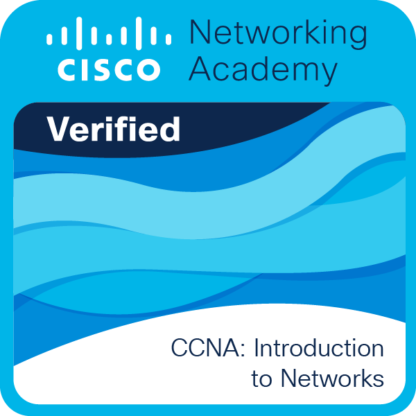
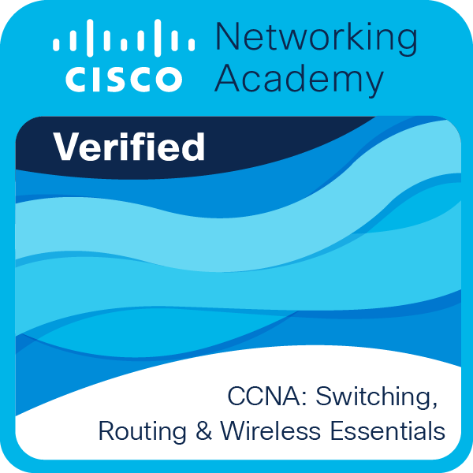
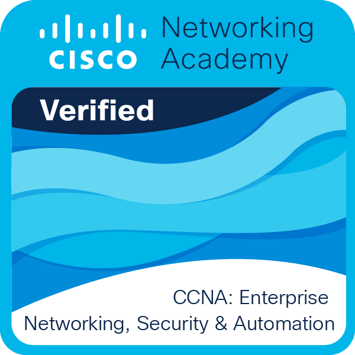

## Hello there! ✨
I'm Ace, also known as Sclumbs, and I'm an aspiring programmer from Portugal.
I've got a passion for different forms of creation, such as digital art and writing.

## Learning 📚
Currently enrolled in college! So, I'm a bit of a beginner.
Languages: C#, Python, Lua/Luau, HTML, CSS, JavaScript and XML/XSD/XSLT
I've also worked with Virtual Machines, Cisco Packet Tracer and SQL Servers

I'm looking forward to work in Game Development (using Godot) in the future.

## Fun Facts 💡
- I have 2 cats
- I want to learn how to play electric guitar
- I like some indie shows and games
- Is it already obvious I like games? No?

## Certifications

  
  
  

