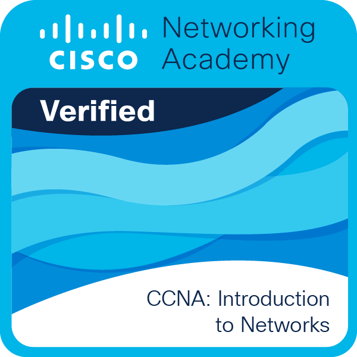

## Hello there! ✨
I'm Ace, also known as Sclumbs, and I'm an aspiring programmer from Portugal!

## Learning 📚
Currently enrolled in college! Thus...I'm a bit of a beginner.
Languages: C#, Python, Lua/Luau, HTML, CSS, JavaScript, SQL and XML/XSD/XSLT.
I've also worked with Virtual Machines and Cisco Packet Tracer!

I'm looking forward to work in Game Development (using Godot) in the future.

## Interests 💡
- Composing music/playing an instrument (Piano, E-Guitar or Drums)
- Animating & 2D Drawing
- Pixel Art
- 3D Modelling
- Writing

## Certifications

  
  
  

